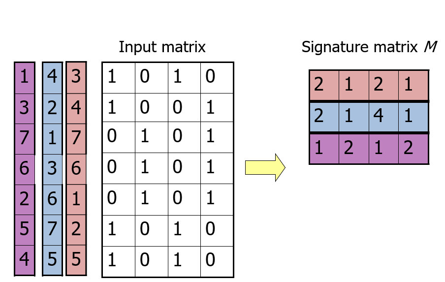
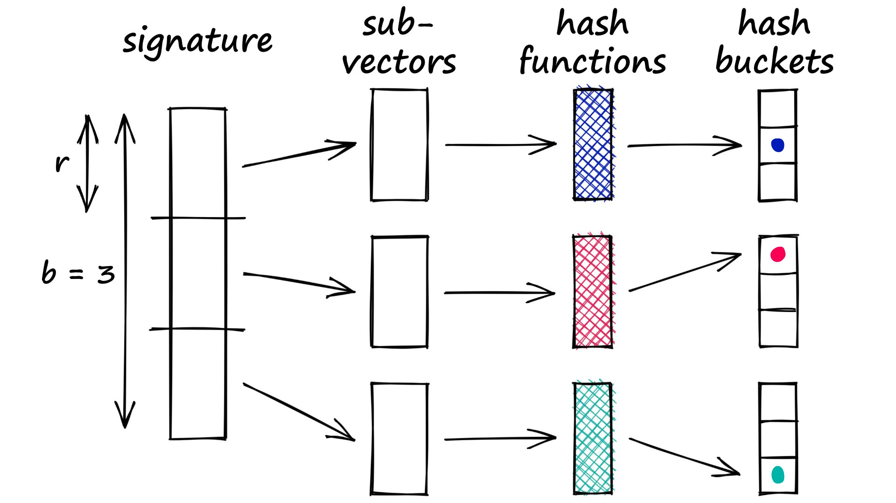
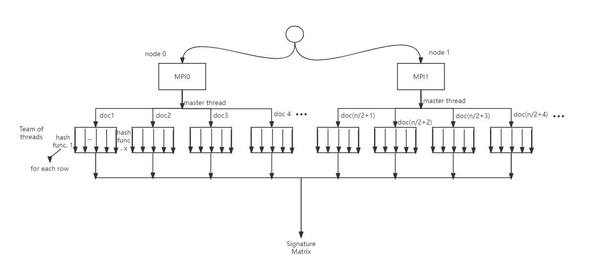
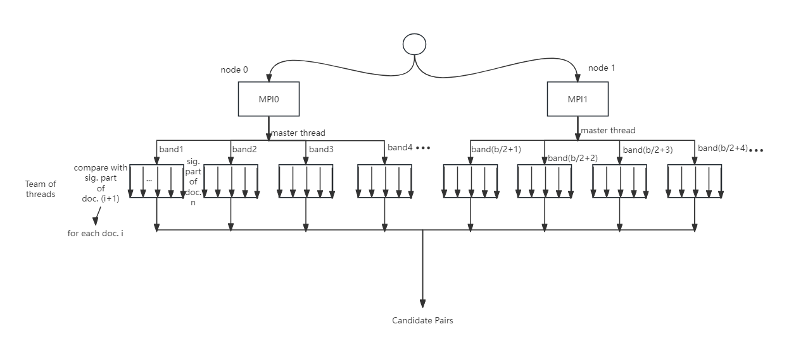
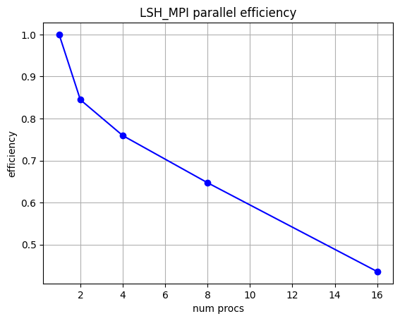

# CSCI596-Final-Project

This is the repository for the final project of CSCI596 Scientific Computing & Visualization at USC. The project is mainly about parallelizing the Locality Sensitive Hashing (LSH) algorithm.

## Introduction to Locality Sensitive Hashing (LSH)

Locality Sensitive Hashing (LSH) is a popular technique used for efficient approximate similarity serach in high-dimensional space. It empowers vector databases that align with Language Model Models (LLMs). Even when comparing a single query to billions of samples, the achieved complexity remains at best O(n). The core idea is to hash data points such that similar items are mapped to the same hash buckets with high probability. There are 3 main steps in tradition LSH: 

1. Shingling: Convert documents to sets of strings of length k. A k-shingle is a sequence of k tokens appears in the document. After we get shingles for all the documents, we union them to create a big vocabulary set. Then we create a sparse vector for each documents. For each shingle in the vocabulary set, we set the corresponding position to 1 if the document has the shingle and set to 0 if not, just like one-hot encoding.
2. MinHashing: The sparse vectors are too large to compare. In this step we will convert them to short signatures, which are dense integer vectors that represent sets and reflect their similarity. Each number in the signature corresponds to a minhash function.  The signature values are generated by first picking a randomly permuted count vector of the rows (from 1 to len(vocab)+1) and finds the minimum number of the row in which is 1 in our sparse vector.

3. Banded LSH function: In order to find signature pairs that share even some similarity and further improve the efficiency, we segment the signatures into bands b (each has r rows), and pass each band through a hash function. Mark the ones that are hashed to the same bucket as candidate pairs. Repeat the process for each band.


## Original Implementation Methods Design
We will parallelize the LSH using MPI and OpenMP target. Both the MinHashing and Banded LSH functions are possible to be parallelized.
* MinHashing: There are n documents which need to generate the signatures. For each document, there are x hash functions to be applied to y rows to get the signature with x numbers. We will split them to 2 MPI nodes, while each node has an OpenMP master thread with league of teams. Each team will deal with one document, with OpenMP pragma directive to parallelize the nested loops regarding the hash functions. Below is the architecture design:


* Banded LSH function：We will get candidate pairs from b bands. For each band, we need to check for each document if its signature pieces are the same as others. If so, they are the candidate pairs. We will split b bands to 2 MPI nodes, while each node has an OpenMP master thread with league of teams. Each team will deal with one band, with OpenMP pragma directive to parallelize the nested loops for the comparisons between every pair of signature pieces. Below is the architecture design:


* Valid pair check: After getting candidate pairs from the banded LSH function. We need to check the real similarity for each pair to filter out valid pairs with a similarity larger than or equal to the threshold. To get the Jaccard similarity bewtween a pair of documents, we need to iterate through each element of the sparse 0-1 matrix of the first step. The process is homework-alike because we want to collect the intersection number and the union number of the vecotr pairs, which can be distribute to different threads and get the reduction results. 

## Code Structure Introduction
### data folder
It contains the real input data that we used to test the performance of our algorithm and a small 4x4 matrix data used for testing the correctness of the algorithm.
* input_data_link.txt: this is the google drive link to the real input data. Since the text file of the real input data is 531 MB, we put it on the google drive. You can download it and change the pathdata variable in the code files to run. It is the sparse 0-1 matrix getting from the first step. Each line corresponds to a document and each column corresponds to a shingle.
* test_matrix.txt: a small 4x4 0-1 matrix used for testing the algorithm design.
### src folder
* lsh.c: the basic version of c code containing the whole process. Construct a Set structure to store the candidate pair results.
* lsh_opt.c: a optimization version of lsh.c. Due to the race conditions related to Set operations, we found that it's difficult to design an efficient parallelization process since the majority computation cost falls into the Set operations. In order to reduce some omp critical operations, we build this version. By changing the candidate pair set to the valid pair set, we reduce the number of set operations while increasing the checking similarity operations which can be better parallelized. **We will use it as the benchmark for parallelization tasks.**
* lsh.h: the header file that contains the declarations of functions and constants. All the .c files will use this header file.
* lsh_opt_omp_openmp.c: Parallelized signature matrix computation and candidate pairs computation using OpenMP.
* lsh_opt_omp_openmp.sl: the .sl file to run the lsh_opt_omp_openmp.c file with 1, 2, 4, 8, 16, 32, 64 threads and generate the output.
* lsh_opt_omp_teams.c: Parallelized signature matrix computation using OpenMP target offload. Due to Set operation limitation, we failed to parallelize the candidate pairs computation to valid pairs generation.
* lsh_opt_omp_teams.sl: the .sl file to run the lsh_opt_omp_teams.c file and generate the output.
* lsh_mpi.c: Parallelized signature matrix computation and candidate pairs computation using MPI.
* lsh_mpi.sl: the .sl file to run the lsh_mpi.c file and generate the output.

## Parallelization Implementation
When we tried to parallelize the algorithm, we found that combining valid pair checking step to the banded LSH function can get better performance, i.e. instead of creating an intermediate candidate set to save all candidate pairs, we will check the similarity of each candidate pair immediately and only save valid pairs to a final result set. Therefore we parallelize the compute_LSH() function by distributing bands with all following operations to different threads.

### MPI parallel computing
We conducted MPI parallel computing on LSH, including:

1. **MinHash signature computing**: Each process is responsible for computing the signatures for part of the documents. Then the full data is distributed back to each process after aggregating it in the main process.
2. **Banded LSH mapping**: The bands are equally distributed to processes, where we check if documents with the same signature pieces are indeed similar, and if so, we add the pair into the result set. Then the results are gathered in the main process.

Eventually we output all the similar file pairs.

### OpenMP Target Offload
* For compute_sig() function, we use **#pragma omp target teams** to distribute documents to the league of teams. Each team will be responsible for documents from index ibgn to iend. Within each team, we distribute the nested for loop of signature computation to team of threads using **#pragma omp parallel for num_threads(SIG_NTRD)**. Each thread will be responsible for one hash function calculation.
```
#pragma omp target teams map(shingle, sig_hash_a, sig_hash_b, sig) num_teams(SIG_NTMS)
    {

        // for (int i = 0; i < DOCCOUNT; i++) // for every document
        // {
#pragma omp distribute
        for (int t = 0; t < SIG_NTMS; t++)
        {
            int ibgn = DOCCOUNT / SIG_NTMS * t;
            int iend = DOCCOUNT / SIG_NTMS * (t + 1);
            if (t == SIG_NTMS - 1)
                iend = DOCCOUNT;
            for (int i = ibgn; i < iend; i++)
            {
#pragma omp parallel for num_threads(SIG_NTRD)
                for (int k = 0; k < HASHCOUNT; k++) // every hash function
                {
                    for (int j = 0; j < SHINGLECOUNT; j++) // loop through all shingle indexes to find min index with value 1
                    {
                        if (shingle[i][j] == 1)
                        {
                            unsigned int res = (((long long)sig_hash_a[k] * j + sig_hash_b[k]) % 233333333333) % SHINGLECOUNT;
                            // printf("%d ", res);
                            sig[i][k] = MIN(sig[i][k], res);
                        }
                    }
                    // printf("\n");
                }
            }
        }
    }
}
```
* For compute_LSH() function, we failed to come up with a practical parallelization implementation due to the set operation problem. Each team will have a private set variable to save the valid pair results from all sub-threads. But the set can only be operated by one thread at one time considering the race condition, which could be a bottleneck of the effectiveness of the parallelization. Also, when copying the set struct results from GPU to CPU, since the element member in the struct is a pointer, the memory address transformation between CPU and GPU machines would be a problem. Further exploration is needed.


## Expected Results
We will test the runtime and efficiency of the algorithm with different parallelization methods and different numbers of nodes and threads by running the program on the CARC clusters. We are expected to see a similar efficiency pattern with strong scaling with more nodes and threads, while the runtime should decrease.

## Result Analysis
### Runtime comparasion between lsh.c and lsh_opt.c: 
* For lsh.c:\
Time for computing signature matrix: 42.359000 seconds.\
Time focr generating valid pairs: >30mins
* For lsh_opt.c:\
Time for computing signature matrix: 41.194000 seconds.\
Time focr generating valid pairs: 46.855000 seconds.\
Valid Pairs In Total: 644 -> **The following parallelization methods all use this version as a baseline.** 

### MPI results
We plotted the parallel efficiency as a function of #procs.



From the graph above, It is evident that the parallel efficiency of our MPI LSH task degrades rapidly as the number of processes increases. This may be attributed to the significant volume of data that needs to be sent and received between processes, which increases the overhead of inter-process communication.

| #procs | Time (s) |
|:--------:|:--------:|
| 1    | 63.15   |
| 2    | 37.38   |
| 4    | 20.79   |
| 8    | 12.20   |
| 16   | 9.06    |

The above is the total time spent when running MPI LSH with different numbers of processes. We obtained a maximum speedup of 6.97 for parallel LSH computation. We can conclude that using MPI to accelerate LSH calculations is highly effective and practically meaningful.

### OpenMP Results

### OpenMP Target Offload Results
* We test the perfomance of the parallelized compute_sig() function (NTMS 72, NTRD 100) with different GPUs including v100, a40, and a100 using following compile command and then running lsh_opt_omp_teams.sl:
```
nvc -mp=gpu -o lsh_opt_omp_teams lsh_opt_omp_teams.c
```
The runtime of different GPU machines are as follows:
| GPU machine                 | Runtime         |
|:--------------------- |:-------------------:|
| v100                    | 2.174501 seconds    |
| a40 | 3.543267 seconds |
| a100 | 3.407109 seconds |

v100 machine gets the shortest runtime while the a100 gets a shorter runtime than a40. It might because the v100 has largest tensor cores (640) among the three and a100 (432) has more tensor cores than a40 (336) according to the information on the [CARC website](https://www.carc.usc.edu/user-information/user-guides/hpc-basics/discovery-resources). And we can see a significant improvement using GPU acceleration compared to baseline sequential code. 

**During this process, we found an error in the assignment 8:**\
To run the OpenMP target offload code on the GPU machine, we need to add the **-mp=gpu** flag. Otherwise it will run on the CPU machine by default and cannot get the acceleration. We tested the runtime with and without **-mp=gpu** flag and compared it with the runtime on CPU. We found that the runtime without **-mp=gpu** flag are nearly the same as the CPU runtime, while the runtime with **-mp=gpu** flag is much shorter. In order to use the **-mp=gpu** flag, we need to apply for a GPU machine higher than or equal to v100.


## Future Work
* The parallelization of compute_LSH() function using GPU machines still needed to be explored.
* For now we separately implemented different parallelization methods. Next step can be exploring the most effective combination of these methods.
* Improve the memory efficiency of the algorithm.
* Try to optimize MPI_Send and MPI_Recv with MPI_Irecv and intermediate computation.

## Contributions
* Sanying Yi (github account: SanyingYi and ysyyy): Wrote the baseline code and implemented OpenMP target offload  and testings. README write-up.
* Zeyu Huang (github account: huang-zeyu): Implemented MPI parallelization and testings. README write-up.
* Hengrui Wang (yahaha-233): Implemented OpenMP parallelization and testings. README write-up.


## Reference
[1] https://www.pinecone.io/learn/series/faiss/locality-sensitive-hashing/

