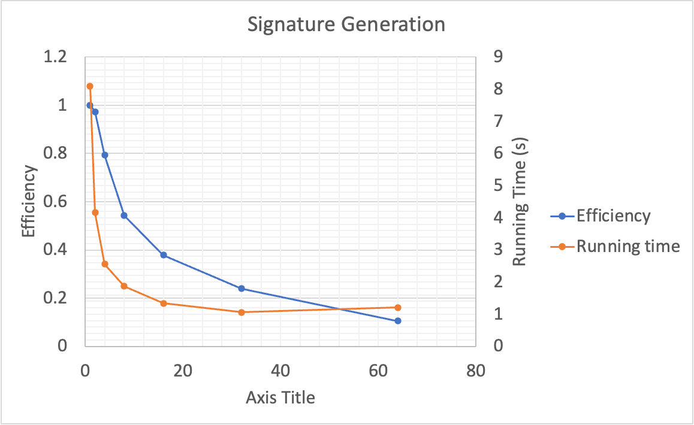
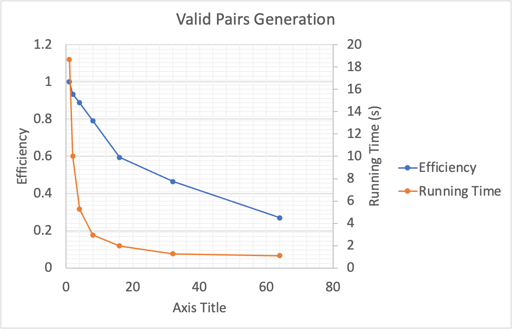

# CSCI596-Final-Project

This is the repository for the final project of CSCI596 Scientific Computing & Visualization at USC. The project is mainly about parallelizing the Locality Sensitive Hashing (LSH) algorithm.

## Introduction to Locality Sensitive Hashing (LSH)

Locality Sensitive Hashing (LSH) is a popular technique used for efficient approximate similarity serach in high-dimensional space. It empowers vector databases that align with Language Model Models (LLMs). Even when comparing a single query to billions of samples, the achieved complexity remains at best O(n). The core idea is to hash data points such that similar items are mapped to the same hash buckets with high probability. There are 3 main steps in tradition LSH: 

1. Shingling: Convert documents to sets of strings of length k. A k-shingle is a sequence of k tokens appears in the document. After we get shingles for all the documents, we union them to create a big vocabulary set. Then we create a sparse vector for each documents. For each shingle in the vocabulary set, we set the corresponding position to 1 if the document has the shingle and set to 0 if not, just like one-hot encoding.
2. MinHashing: The sparse vectors are too large to compare. In this step we will convert them to short signatures, which are dense integer vectors that represent sets and reflect their similarity. Each number in the signature corresponds to a minhash function.  The signature values are generated by first picking a randomly permuted count vector of the rows (from 1 to len(vocab)+1) and finds the minimum number of the row in which is 1 in our sparse vector.

3. Banded LSH function: In order to find signature pairs that share even some similarity and further improve the efficiency, we segment the signatures into bands b (each has r rows), and pass each band through a hash function. Mark the ones that are hashed to the same bucket as candidate pairs. Repeat the process for each band.


## Original Implementation Methods Design
We will parallelize the LSH using MPI and OpenMP target. Both the MinHashing and Banded LSH functions are possible to be parallelized.
* MinHashing: There are n documents which need to generate the signatures. For each document, there are x hash functions to be applied to y rows to get the signature with x numbers. We will split them to 2 MPI nodes, while each node has an OpenMP master thread with league of teams. Each team will deal with one document, with OpenMP pragma directive to parallelize the nested loops regarding the hash functions. Below is the architecture design:


* Banded LSH function：We will get candidate pairs from b bands. For each band, we need to check for each document if its signature pieces are the same as others. If so, they are the candidate pairs. We will split b bands to 2 MPI nodes, while each node has an OpenMP master thread with league of teams. Each team will deal with one band, with OpenMP pragma directive to parallelize the nested loops for the comparisons between every pair of signature pieces. Below is the architecture design:


* Valid pair check: After getting candidate pairs from the banded LSH function. We need to check the real similarity for each pair to filter out valid pairs with a similarity larger than or equal to the threshold. To get the Jaccard similarity bewtween a pair of documents, we need to iterate through each element of the sparse 0-1 matrix of the first step. The process is homework-alike because we want to collect the intersection number and the union number of the vecotr pairs, which can be distribute to different threads and get the reduction results. 

## Code Structure Introduction
### data folder
It contains the real input data that we used to test the performance of our algorithm and a small 4x4 matrix data used for testing the correctness of the algorithm.
* input_data_link.txt: this is the google drive link to the real input data. Since the text file of the real input data is 531 MB, we put it on the google drive. You can download it and change the pathdata variable in the code files to run. It is the sparse 0-1 matrix getting from the first step. Each line corresponds to a document and each column corresponds to a shingle.
* test_matrix.txt: a small 4x4 0-1 matrix used for testing the algorithm design.
### src folder
* lsh.c: the basic version of c code containing the whole process. Construct a Set structure to store the candidate pair results.
* lsh_opt.c: a optimization version of lsh.c. Due to the race conditions related to Set operations, we found that it's difficult to design an efficient parallelization process since the majority computation cost falls into the Set operations. In order to reduce some omp critical operations, we build this version. By changing the candidate pair set to the valid pair set, we reduce the number of set operations while increasing the checking similarity operations which can be better parallelized. **We will use it as the benchmark for parallelization tasks.**
* lsh.h: the header file that contains the declarations of functions and constants. All the .c files will use this header file.
* lsh_opt_omp_openmp.c: Parallelized signature matrix computation and valid pairs computation using OpenMP.
* lsh_opt_omp_openmp.sl: the .sl file to run the compiled lsh_opt_omp_openmp file with 1, 2, 4, 8, 16, 32, 64 threads and generate the output.
* lsh_opt_omp_teams.c: Parallelized signature matrix computation using OpenMP target offload. Due to Set operation limitation, we failed to parallelize the candidate pairs computation to valid pairs generation.
* lsh_opt_omp_teams.sl: the .sl file to run the lsh_opt_omp_teams.c file and generate the output.

## Parallelization Implementation
When we tried to parallelize the algorithm, we found that combining valid pair checking step to the banded LSH function can get better performance. Therefore we parallelize the compute_LSH() function instead of parallelizing those functions separately.

### OpenMP
To use OpenMP to parallelize the LSH algorithm, the most intuitive way is to **parallelize the for loops** in our original code.

1. We can see that in function ```compute_sig()``` we need to generate a specific number of signatures using hash functions for each document. 
So, we can **distribute the work of *one document's signature generation* to a bunch of threads**. 
In this way, we can speed up the signature generation process.

2. In function ```compute_LSH()```, we divide the signature matrix into several bands. 
For each band, we need to check if the signature pieces are the same as others. If so, they are the candidate pairs. And if the two documents are similar enough, they are the valid pairs. 
We can **distribute the work of *checking the signature pieces*, the work of *checking the documents' similarity* to different threads**. 
In this way, we can speed up the valid pairs generation process.

## Expected Results
We will test the runtime and efficiency of the algorithm with different parallelization methods and different numbers of nodes and threads by running the program on the CARC clusters. We are expected to see a similar efficiency pattern with strong scaling with more nodes and threads, while the runtime should decrease.

## Analysis
### Runtime comparasion between lsh.c and lsh_opt.c: 
* For lsh.c:\ Time for computing signature matrix: 42.359000 seconds.\ Time focr generating valid pairs: >30mins
* For lsh_opt.c:\ Time for computing signature matrix: 41.194000 seconds.\ Time focr generating valid pairs: 46.855000 seconds.\ Valid Pairs In Total: 644 -> **The following parallelization methods all use this version as a baseline.** 

### OpenMP Results
To compile the OpenMP code and run it on CARC, we need to use the following command:
```
$ module load gcc
$ gcc -fopenmp -O -o lsh_opt_openmp lsh_opt_openmp.c
$ sbatch lsh_opt_openmp.sl
```
The output will be saved in the file defined in the ```.sl``` file, starting with the number of threads and then the runtime and valid pairs in total.

Example output:
```
1
Compute Sig ...
Time for computing signature matrix: 8.099872 seconds
Time for generating valid pairs: 18.956838 seconds
Time for merging sets: 0.000107 seconds
Valid Pairs In Total: 644
```

We plot the runtime and efficiency of the OpenMP code with different numbers of threads. The results are shown below:
1. For signature generation running on 1 node with 1, 2, 4, 8, 16, 32, 64 threads:


2. For valid pairs generation running on 1 node with 1, 2, 4, 8, 16, 32, 64 threads:



## Reference
[1] https://www.pinecone.io/learn/series/faiss/locality-sensitive-hashing/

